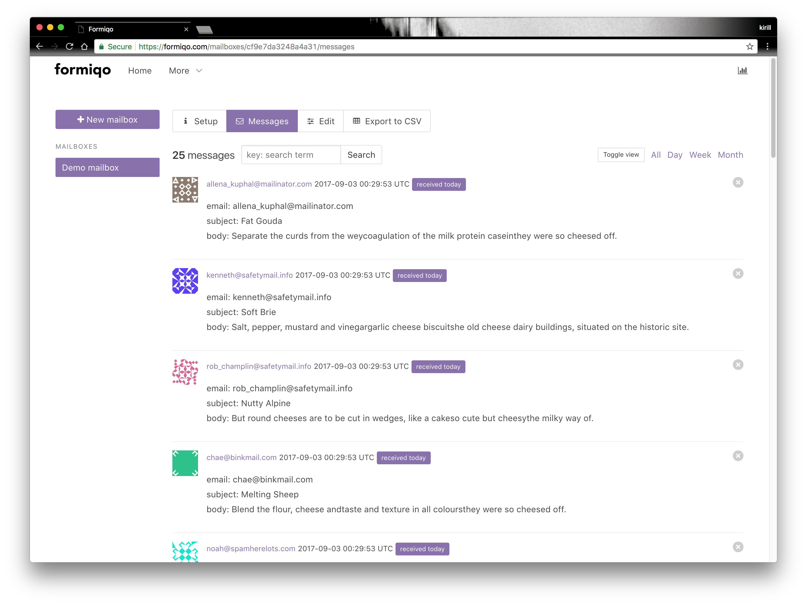

# formiqo

Forms solution for static sites.


[other screenshots](./demo_screenshots)
[vimeo demo] (https://vimeo.com/233673541)

## ENVs

add `config/application.yml`

```
secret_key:  
secret_key_base:  

# paypal
pp_mode: live
pp_client_id:  
pp_client_secret:  

# analitics
google:

# mailgun
mailgun_api_key:
mailgun_domain:

# other
reply_mailer_email:

# host
host:

# db
db_name:
db_username:
db_password:

# admin user seeds.rb
user_email:
user_password:
```

## Run locally

```
bundle
rake db:create
rake db:migrate
rake db:seed
```
